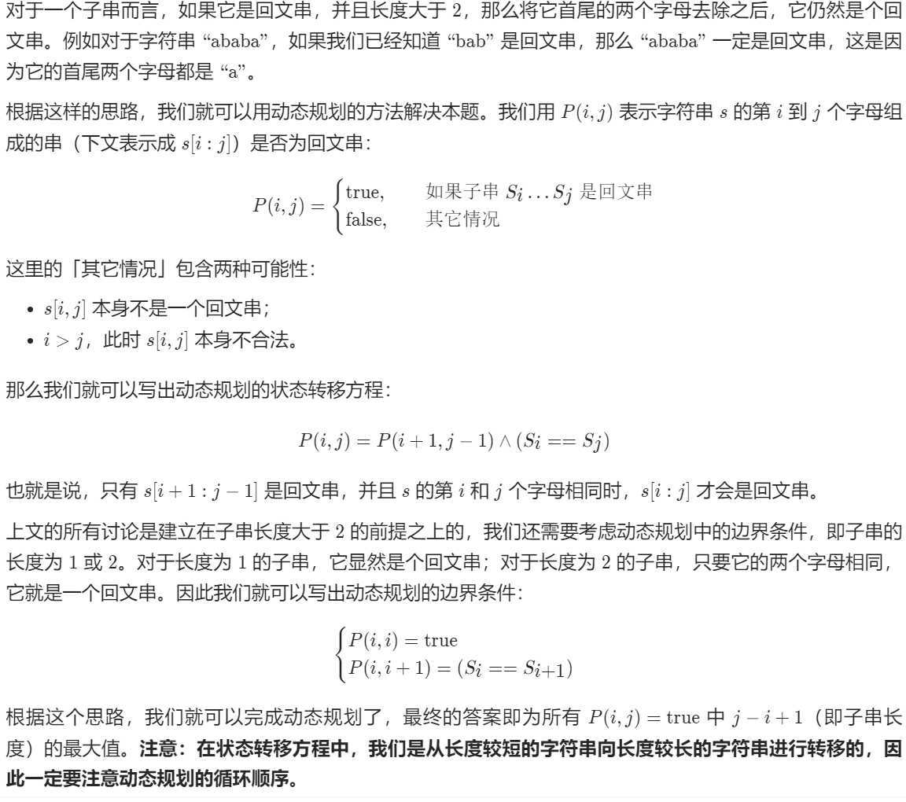

### 题目：

提供一个字符串 `s`，找到 `s` 中最长的回文子串。

### 难度：

中等

### 示例：

```
输入：s = "babad"
输出："bab"
解释："aba" 同样是符合题意的答案。
输入：s = "cbbd"
输出："bb"
```

### 解题思路：

根据题解的方法主要有三种：
1.动态规划
2.中心扩展
3.马拉车算法
我想到的是中心扩展算法，所以使用动态规划来解这道题我还没有实现。

```
我的想法：
回文字符串的特征为其子串（两边同时加减若干个字符）也为回文字符串。
根据这一特点，可以找到最短的回文子串后(一或者两个相同字符)进行两边扩展来实现。
最短子串可以能为一到两个。需要分别进行讨论。
最终比较哪个子串长度最长然后输出。
```

### 代码实现：

```c++
class Solution {
public:
    string longestPalindrome(string s) {
        //字符子串的头与尾。
        int head = 0, toil = 0;
        //字符回文字符串串的长度。
        int length = 0;

        //如果字符串长度小于2直接返回。
        if(s.size() < 2){
            return s;
        }
        //输出字符串长度
        //cout << s.size();
        //字符串长度大于2，进行第一次遍历，寻找以一个字符为中心的回文字符串。
                //暂存目前最长子串的位置。
        int substr_head_single = 0, substr_toil_single = 0;
        //暂存最长回文子串的长度
        int substr_len_single = 0;
        for(int i = 0; i < s.size(); i++ ){
            head = toil = i;//一个字符必为回文字符串。
            //注意这里的判别顺序。
            while((head - 1 >= 0) && (toil + 1 < s.size()) && (s[head - 1] == s[toil + 1])){
                head--;
                toil++;
            }
            //求当前长度与暂存长度做对比。
            length = toil - head + 1;
            //与暂存当前最长回文字符串值进行比较
            substr_len_single = substr_toil_single - substr_head_single + 1;
            if(length > substr_len_single){
                substr_head_single = head;
                substr_toil_single = toil;
            }
            substr_len_single = substr_toil_single - substr_head_single + 1;
            //cout << "single:" << substr_len_single << endl;
        }

        //字符串长度大于2，进行第二次遍历，寻找以两个字符为中心的回文字符串。
        int substr_head_double = 0, substr_toil_double = 0;
        //暂存最长回文子串的长度
        int substr_len_double = 0;        
        for(int j = 0; j + 1< s.size(); j++){
            //如果当前s[j] == s[j+1],表明这两个字符已经构成回文字符串
            if( s[j] == s[j+1] ){
                head = j;
                toil = j+1;
                while((head - 1 >= 0) && (toil + 1 < s.size()) && (s[head - 1] == s[toil + 1])){
                    head --;
                    toil ++;
                }
                //求当前长度与暂存长度做对比。
                length = toil - head + 1;
                //与暂存当前最长回文字符串值进行比较
                substr_len_double = substr_toil_double - substr_head_double + 1;
                if(length > substr_len_double){
                    substr_head_double = head;
                    substr_toil_double = toil;
                }
                substr_len_double = substr_toil_double - substr_head_double + 1;
                //cout << "double:" << substr_len_double << endl;             
            }
        }
        //遍历结束，返回最长回文子串。
        //比较一个字符长度和两个字符长度的回文子串的最大长度。
        if(substr_len_single > substr_len_double){
            return s.substr(substr_head_single, substr_len_single); 
        }else{
            return s.substr(substr_head_double, substr_len_double);
        }
        
        
    }
   
};
//通俗易懂但是比较繁琐，有很多地方可以简化。
```

### 知识点：

### 1.动态规划

**我的理解：**

动态规划的作用是利用递归的方法思考问题，利用迭代的方法解决问题。

**原理：**

问题的最优解如果可以由子问题的最优解推导得到，则可以先求解子问题的最优解，在构造原问题的最优解；若子问题**有较多的重复出现**，则可以**自底向上**从最终子问题向原问题逐步求解。

**使用条件：**

可分为多个相关子问题，子问题的解被重复使用。

- Optimal substructure（优化子结构）：
  - 一个问题的优化解包含了子问题的优化解
  - 缩小子问题集合，只需那些优化问题中包含的子问题，降低实现复杂性
  - 我们可以自下而上的
- Subteties（重叠子问题）：在问题的求解过程中，很多子问题的解将被多次使用。

**动态规划算法的设计步骤：**

- 分析优化解的结构
- 递归地定义最优解的代价
- 自底向上地计算优化解的代价保存之，并获取构造最优解的信息
- 根据构造最优解的信息构造优化解

**动态规划特点：**

- 把原始问题划分成一系列子问题；
- 求解每个子问题仅一次，并将其结果保存在一个表中，以后用到时直接存取，不重复计算，节省计算时间
- 自底向上地计算。
- 整体问题最优解取决于子问题的最优解（状态转移方程）（将子问题称为状态，最终状态的求解归结为其他状态的求解）

**官方解答：**



### 官方代码：

```
class Solution {
public:
    pair<int, int> expandAroundCenter(const string& s, int left, int right) {
        while (left >= 0 && right < s.size() && s[left] == s[right]) {
            --left;
            ++right;
        }
        return {left + 1, right - 1};
    }

    string longestPalindrome(string s) {
        int start = 0, end = 0;
        for (int i = 0; i < s.size(); ++i) {
            auto [left1, right1] = expandAroundCenter(s, i, i);
            auto [left2, right2] = expandAroundCenter(s, i, i + 1);
            if (right1 - left1 > end - start) {
                start = left1;
                end = right1;
            }
            if (right2 - left2 > end - start) {
                start = left2;
                end = right2;
            }
        }
        return s.substr(start, end - start + 1);
    }
};
//写了一个函数来减少重复工作。思路一样。
```

### 热评：

```
看到回文串，别人都是想的怎么解题，就我想着多放孜然。我没救了
```

```
题解：......abababa...... 我： ......阿巴阿巴阿巴......
```

